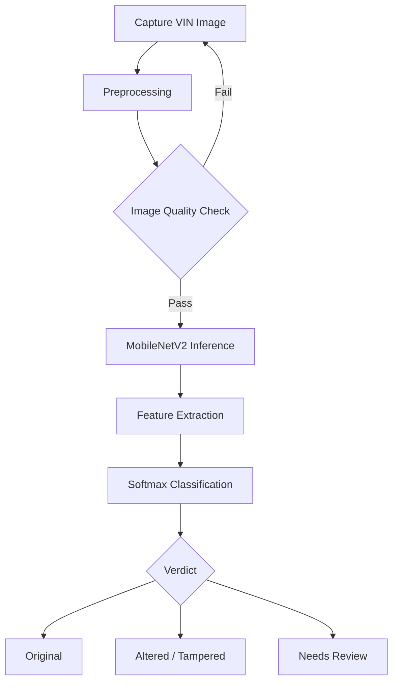
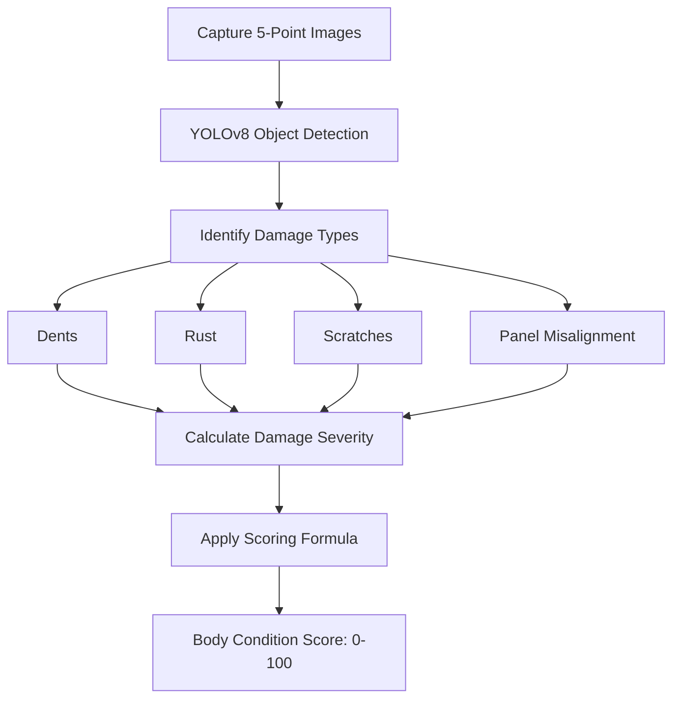
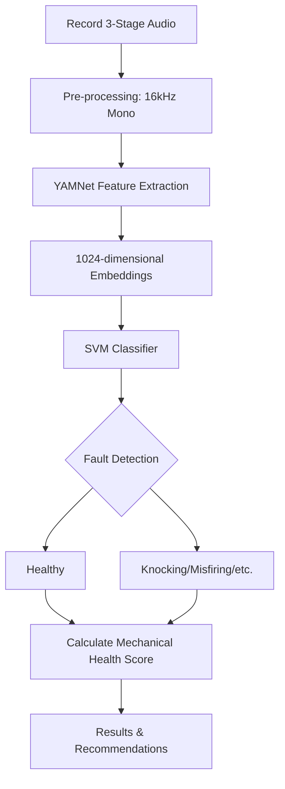
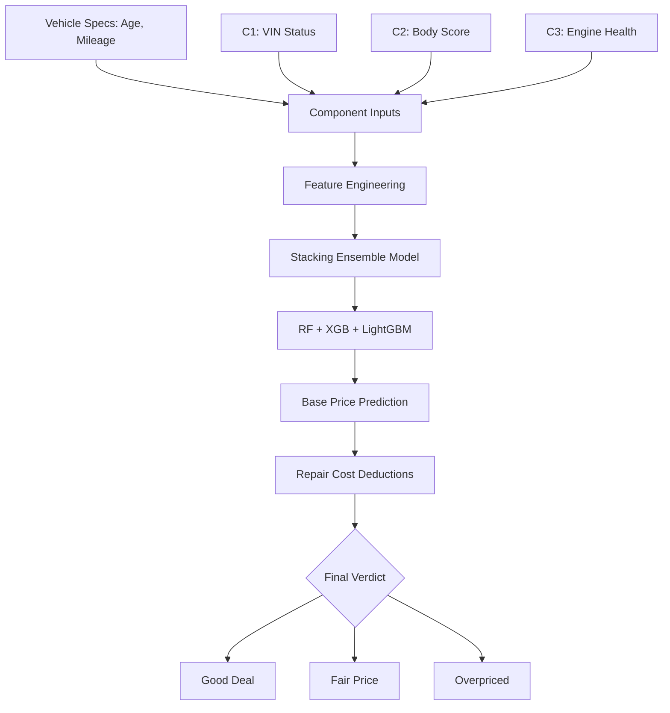

# Watinakama.LK Component Workflows

This document provides a visual explanation of the workflow for each of the four research components in the Watinakama.LK system.

## Component 1: VIN Authentication & Verification
This component ensures vehicle authenticity by detecting tampered or altered Vehicle Identification Numbers (VIN).

---

## Component 2: Automated Body Condition Analysis
This component uses computer vision to detect physical damages and calculate a numerical health score for the vehicle's exterior.

---

## Component 3: Engine Sound-Based Fault Diagnosis
This component analyzes acoustic signatures from the engine to detect mechanical faults without physical disassembly.

---

## Component 4: Market Valuation & Price Prediction
The final component integrates data from all previous modules and vehicle specifications to predict a fair market price.

